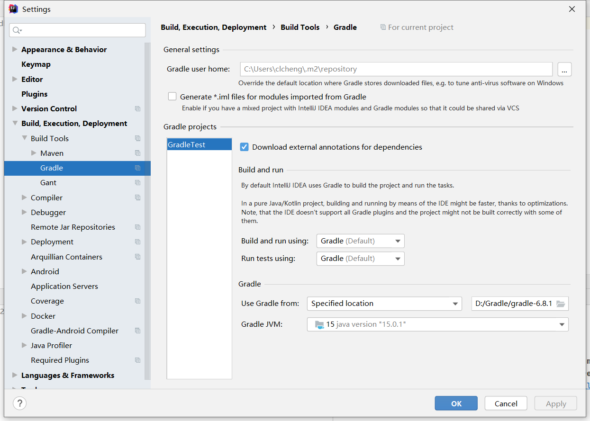

# 1 阿里云仓库源配置

https://maven.aliyun.com/mvn/guide

## 1.1 仓库介绍

阿里云Maven中央仓库为 [阿里云云效](https://flow.aliyun.com/?channel=maven.aliyun) 提供的公共代理仓库，帮助研发人员提高研发生产效率，使用阿里云Maven中央仓库作为下载源，速度更快更稳定。

而像Spring Boot项目大多依赖还是会从`repo.spring.io`下载，所以还是很慢，所以就需要设置代理仓。

## 1.2 配置指南

### 1.2.1 maven配置指南

打开 maven 的配置文件（ windows 机器一般在 maven 安装目录的 **conf/settings.xml** ），在<mirrors></mirrors>标签中添加 mirror 子节点:

```
<mirror>
  <id>aliyunmaven</id>
  <mirrorOf>*</mirrorOf>
  <name>阿里云公共仓库</name>
  <url>https://maven.aliyun.com/repository/public</url>
</mirror>
```

如果想使用其它代理仓库，可在<repositories></repositories>节点中加入对应的仓库使用地址。以使用 spring 代理仓为例：

**注：** `<repositories></repositories>`在`pom.xml`中配置，而不是`conf/setting.xml`

```
<repository>
  <id>spring</id>
  <url>https://maven.aliyun.com/repository/spring</url>
  <releases>
    <enabled>true</enabled>
  </releases>
  <snapshots>
    <enabled>true</enabled>
  </snapshots>
</repository>
```

在你的 **pom.xml** 文件<denpendencies></denpendencies>节点中加入你要引用的文件信息：

```
<dependency>
  <groupId>[GROUP_ID]</groupId>
  <artifactId>[ARTIFACT_ID]</artifactId>
  <version>[VERSION]</version>
</dependency>
```

执行拉取命令：

```bash
mvn install
```

### 1.2.2 gradle 配置指南

- Gradle没有系统配置文件，是需要配置工程中的`build.gradle`即可

在 build.gradle 文件中加入以下代码:

```
allprojects {
  repositories {
    maven {
      url 'https://maven.aliyun.com/repository/public/'
    }
    mavenLocal()
    mavenCentral()
  }
}
```

如果想使用其它代理仓，以使用spring仓为例，代码如下:

```
allProjects {
  repositories {
    maven {
      url 'https://maven.aliyun.com/repository/public/'
    }
    maven {
      url 'https://maven.aliyun.com/repository/spring/'
    }
    mavenLocal()
    mavenCentral()
  }
}
```

加入你要引用的文件信息：

```
dependencies {
  compile '[GROUP_ID]:[ARTIFACT_ID]:[VERSION]'
}
```

执行命令：

```
gradle dependencies 或 ./gradlew dependencies 安装依赖
```

## 1.3 具体配置

### 1.3.1 Maven

- 环境变量：`M2_HOME`
- 验证安装成功：`mvn -v`
- 自动获取本地JDK

#### 1.3.1.1 pom.xml

```xml
<?xml version="1.0" encoding="UTF-8"?>
<project xmlns="http://maven.apache.org/POM/4.0.0"
         xmlns:xsi="http://www.w3.org/2001/XMLSchema-instance"
         xsi:schemaLocation="http://maven.apache.org/POM/4.0.0 http://maven.apache.org/xsd/maven-4.0.0.xsd">
    <modelVersion>4.0.0</modelVersion>

    <groupId>top.clcheng.www</groupId>
    <artifactId>MavenTest</artifactId>
    <version>1.0-SNAPSHOT</version>

<!--    spring代理仓   -->
    <repositories>
        <repository>
            <id>spring</id>
            <url>https://maven.aliyun.com/repository/spring</url>
            <releases>
                <enabled>true</enabled>
            </releases>
            <snapshots>
                <enabled>true</enabled>
            </snapshots>
        </repository>
    </repositories>
</project>
```

#### 1.3.1.2 setting.xml

**注：**maven访问中央仓库时会依次访问<mirror>的镜像源，都获取不到就会访问远程中央仓库

```xml
<mirrors>
    <!-- mirror
     | Specifies a repository mirror site to use instead of a given repository. The repository that
     | this mirror serves has an ID that matches the mirrorOf element of this mirror. IDs are used
     | for inheritance and direct lookup purposes, and must be unique across the set of mirrors.
     |
    <mirror>
      <id>mirrorId</id>
      <mirrorOf>repositoryId</mirrorOf>
      <name>Human Readable Name for this Mirror.</name>
      <url>http://my.repository.com/repo/path</url>
    </mirror>
     -->
     <!-- 配置阿里源 -->
    <mirror>
      <id>aliyunmaven</id>
      <mirrorOf>*</mirrorOf>
      <name>阿里云公共仓库</name>
      <url>https://maven.aliyun.com/repository/public</url>
    </mirror>

    <mirror>
        <id>aliyun-google</id>
        <mirrorOf>*</mirrorOf>
        <name>aliyun google</name>
        <url>https://maven.aliyun.com/repository/google</url>
    </mirror>


    <mirror>
        <id>aliyun-gradle-plugin</id>
        <mirrorOf>*</mirrorOf>
        <name>aliyun gradle-plugin</name>
        <url>https://maven.aliyun.com/repository/gradle-plugin</url>
    </mirror>

    <mirror>
        <id>aliyun-spring</id>
        <mirrorOf>*</mirrorOf>
        <name>aliyun spring</name>
        <url>https://maven.aliyun.com/repository/spring</url>
    </mirror>

    <mirror>
        <id>aliyun-spring-plugin</id>
        <mirrorOf>*</mirrorOf>
        <name>aliyun spring-plugin</name>
        <url>https://maven.aliyun.com/repository/spring-plugin</url>
    </mirror>

    <mirror>
        <id>aliyun-grails-core</id>
        <mirrorOf>*</mirrorOf>
        <name>aliyun grails-core</name>
        <url>https://maven.aliyun.com/repository/grails-core</url>
    </mirror>

    <mirror>
        <id>aliyun-apache-snapshots</id>
        <mirrorOf>*</mirrorOf>
        <name>aliyun apache-snapshots</name>
        <url>https://maven.aliyun.com/repository/apache-snapshots</url>
    </mirror>

  </mirrors>
```

### 1.3.2 Gradle

- 环境变量
  - Gradle安装目录：`GRADLE_HOME`
  - Gradle指定本地仓库：`GRADLE_USER_HOME`（给idea看的）
- 验证安装成功：`gradle -v`
- 自动获取本地JDK
- Gradle的配置只需要配置项目中的`build.gradle`&设置系统Gradle


#### 1.3.2.1 build.gradle

```xml
plugins {
    id 'java'
}

group 'top.clcheng.www'
version '1.0-SNAPSHOT'

repositories {
    maven {
        url 'https://maven.aliyun.com/repository/public/'
    }
	//spring代理仓
    maven {
        url 'https://maven.aliyun.com/repository/spring/'
    }
	//使用本地maven仓库
    mavenLocal()
	//使用maven中央仓库，访问上面maven闭包的url
    mavenCentral()
}

dependencies {
    testCompile group: 'junit', name: 'junit', version: '4.12'
    compile group: 'org.springframework.boot', name: 'spring-boot-starter-web', version: '2.4.2'
}
```



# 2 Maven

# 3 Gradle

​		单个Gradle的配置文件有两个：`setting.gradle`和`build.gradle`。`setting.gradle`是用来管理多项目的，其中包含了项目的name。gradle工程的主要配置文件是`build.gradle`：

```groovy
plugins {
    id 'java'
}

group 'top.clcheng.www'
version '1.0-SNAPSHOT'

repositories {
    maven {
        url 'https://maven.aliyun.com/repository/public/'
    }
    mavenLocal()
    mavenCentral()
}

dependencies {
    testCompile group: 'junit', name: 'junit', version: '4.12'
}
```

- plugin：应用的插件
- version：项目版本，SNAPSHOT是快照的意思，指开发版本
- repositories：拉取依赖的地址
  - maven：指定远程仓库（支持多个）
  - mavenLocal()：使用本地maven仓库
  - mavenCentral()：中央仓库，maven可以指定仓库
- dependencies：声明项目的依赖jar包